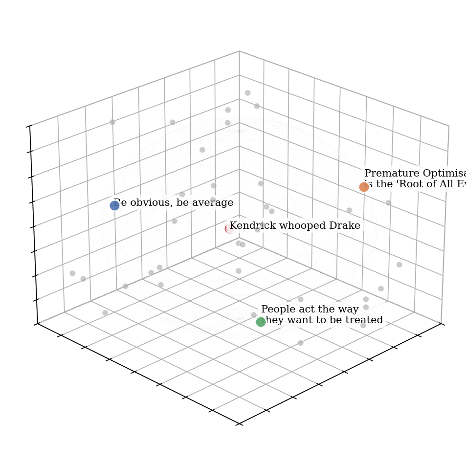
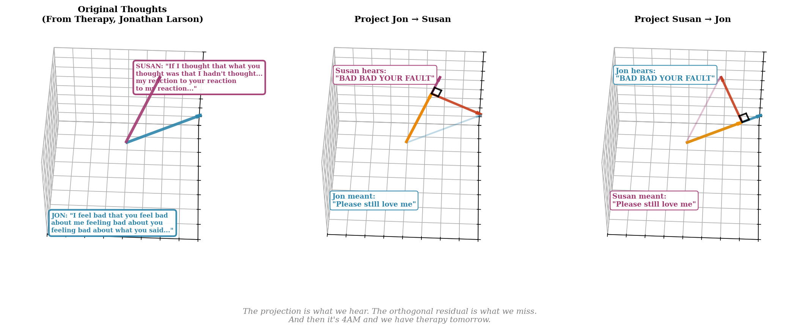

import Math from "../../../src/components/Math"
import SpotifyTrack from "../../../src/components/SpotifyTrack"

Work has recently made me think a lot about the concept of 'orthogonality'. It's helped me iterate on some of my personal beliefs:

1. **Understand your blind ~~spots~~ dimensions.**
2. **Take ~~more~~ different risks**
3. **Nurture your ~~unique~~ orthogonal gifts**

First, what does orthogonality, the state of two vectors being *orthogonal*, mean? Here are some definitions that get increasingly less precise but more intuitive.

Two vectors <Math>{"u"}</Math> and <Math>{"v"}</Math> are orthogonal if...

1. Their inner product is zero: <Math>{"\\langle u, v \\rangle = 0"}</Math>
2. They meet at a right angle
3. They are maximally independent, meaning knowing something about one tells you absolutely nothing about the other ([datcreativity.com](https://www.datcreativity.com))
4. One represents genuinely new information that expands what the space can express with the other

## 1. Understand your blind dimensions.

> The little quail laughs at him, saying, "Where does he think he's going? I give a great leap and fly up, but I never get more than ten or twelve yards before I come down fluttering among the weeds and brambles. And that's the best kind of flying, anyway! Where does he think he's going?" Such is the difference between big and little.
> - Zhuangzi

How would we model the collection of your thoughts?

The most natural model to me feels like a high dimensional space, where each point represents a single thought. In a similar way to how embeddings like [CLIP](https://openai.com/index/clip/) represent abstract dimensions, I don't know what these dimensions intuitively 'mean' or are, but for instance, since we all consume and excrete food, I imagine some dimensions are probably highly correlated with concepts like taste and hunger.



My brain ^.

Ok, so then, how does communication work? One quick observation is that communication happens. So, our thoughts must have a pretty good low rank approximation, i.e. they can be projected down to a shared dimension without losing too much information.



But what about moments of major miscommunication? When we bicker with loved ones? Or when a teacher has explained something to you that completely went over your head? These to me are signs there are orthogonal components in our thought space. It's not just disagreement. It's more like confusion.

Viewing this misunderstanding from the perspective of orthogonalisation tells us it's not just a 'blind spot', a little patch you can't see when you're backing out of a parking spot. It's an entire dimension of reality. The above passage from Zhuangzi captures this viscerally for me. For a quail, it doesn't understand the Peng that is flying for thousands of kilometres in the sky. There are things that completely fly over our heads (in a dimensional sense, literally). To a consciousness confined to a subspace, an orthogonal vector is invisible.

In this model so far, gaining a new dimension is impossible - we have a fixed model of communication where we only hear things the way we can. But we know this isn't the case. We've all had the magical experience of seeing things in ways we haven't before. After all, mathematically, discovering new dimensions is sort of trivial. You just need a single example that can't be expressed as a linear combination of your basis vectors. One counterexample immediately proves the new dimension exists. The real problem isn't that orthogonal dimensions are _undetectable_—it's that without encountering them, you have no reason to suspect they exist. The world's a mysterious place.

## 2. Take different risks:

First, a quick overview on why independent bets are great. Suppose you have a bet with expected value <Math>{"\\mu"}</Math> and variance <Math>{"\\sigma^2"}</Math>. If you take <Math>{"n"}</Math> independent identical bets, the central limit theorem tells us:

- Your total expected value scales linearly: <Math>{"n\\mu"}</Math>
- Your total variance scales linearly: <Math>{"n\\sigma^2"}</Math>
- But your _standard deviation per unit expectation_ scales as <Math>{"\\sqrt{n}"}</Math>

This means taking more of the same bet gives you <Math>{"\\sqrt{n}"}</Math> times better risk-adjusted returns, which is pretty neat.

Now consider taking bets on _uncorrelated_ outcomes. This is where portfolio theory becomes powerful. Let <Math>{"\\mathbf{w} = (w_1, w_2, \\ldots, w_n)^T"}</Math> be your portfolio weights (where <Math>{"\\sum w_i = 1"}</Math>), <Math>{"\\mathbf{r} = (r_1, r_2, \\ldots, r_n)^T"}</Math> be the vector of asset returns, and <Math>{"\\Sigma"}</Math> be the covariance matrix where <Math>{"\\Sigma_{ij} = \\text{Cov}(r_i, r_j)"}</Math>.

Portfolio variance becomes:

<Math display>{"\\sigma_p^2 = \\mathbf{w}^T \\Sigma \\mathbf{w} = \\sum_{i=1}^n \\sum_{j=1}^n w_i w_j \\Sigma_{ij}"}</Math>

Expected return is simply:

<Math display>{"\\mu_p = \\mathbf{w}^T \\boldsymbol{\\mu}"}</Math>

The diagonal terms <Math>{"w_i^2 \\sigma_i^2"}</Math> represent each asset's individual risk contribution—these scale with the square of your allocation.

But the off-diagonal terms <Math>{"2w_i w_j \\rho_{ij} \\sigma_i \\sigma_j"}</Math> are where diversification happens. With <Math>{"n"}</Math> assets, you have <Math>{"n"}</Math> diagonal terms but <Math>{"\\frac{n(n-1)}{2}"}</Math> off-diagonal terms. As <Math>{"n"}</Math> grows large, the off-diagonal correlations dominate. If correlations are low, adding more assets drives portfolio variance toward zero even while maintaining positive expected returns. You get the numerator (returns) without the denominator (risk).

The critical insight is in the off-diagonal terms: <Math>{"2w_i w_j \\rho_{ij} \\sigma_i \\sigma_j"}</Math>. When assets are _orthogonal_ (<Math>{"\\rho = 0"}</Math>), these terms vanish entirely—you get pure variance reduction with no interference. But when <Math>{"\\rho > 0"}</Math>, these positive cross-terms _add_ to your total variance, contaminating the diversification benefit.

With <Math>{"n"}</Math> assets, you have <Math>{"n"}</Math> variance terms but <Math>{"\\frac{n(n-1)}{2}"}</Math> correlation terms. As <Math>{"n"}</Math> grows, the correlations increasingly dominate the portfolio variance. If those correlations are near zero (orthogonal dimensions), your portfolio variance shrinks proportional to <Math>{"\\frac{1}{n}"}</Math>—you get the law of large numbers working for you. But if <Math>{"\\rho"}</Math> is high across all pairs, you're essentially holding one asset in <Math>{"n"}</Math> different wrappers.

Orthogonality isn't just helpful—it's the _only_ thing that makes diversification work. Without it, <Math>{"\\mathbf{w}^T \\Sigma \\mathbf{w}"}</Math> doesn't shrink as you add dimensions; it stays stubbornly high because the covariance matrix remains rank-deficient in the effective dimension space.

So what about in day to day life? Well, we could find dimensions that are genuinely uncorrelated with your existing sources of satisfaction. Just as uncorrelated assets let you increase returns without proportionally increasing risk, uncorrelated life investments let you increase total well-being without cannibalizing what you already have.

For the last two years, I've been tracking 12 life dimensions every two weeks:

```python
['Adventure & Creativity', 'Career & Work', 'Character & Identity', 
'Contribution & Impact', 'Education & Skill Development', 
'Emotions & Well-Being', 'Health & Fitness', 'Location & Tangibles', 
'Money & Finances', 'Productivity & Organization', 
'Social Life & Relationships', 'Values & Purpose']
```

Think of each dimension as an asset. My "portfolio" is how I allocate time and energy. The key question: which dimensions give me independent sources of satisfaction?

First, what are my major correlated clusters? Running PCA reveals three main factors:


- **PC1 (General thriving):** When career, health, relationships, and emotions move together - the "everything is good" feeling
- **PC2 (Achievement-wellbeing tradeoff):** Career and productivity gains that come at the cost of emotions and relationships
- **PC3 (Impact-material tradeoff):** Contribution and purpose versus money and tangibles

These clusters reveal correlation structure. PC1 shows that my satisfaction sources are actually the same bet in different wrappers - when work goes well, I feel good, socialize more, stay healthy. That's high <Math>{"\\rho"}</Math> across multiple dimensions.

To find orthogonal components, we compute the mean absolute correlation |r| for each dimension against all others:


**Contribution & Impact** has the lowest mean correlation—it's the most independent from my other life dimensions, signalling it's an orthogonal asset.

What does this mean practically?
- When I invest time in career advancement, it correlates with decreased well-being and social life (PC2 tradeoff)
- When I focus on health and relationships, they tend to move together (PC1 cluster)
- But when I work on contribution and impact - writing, teaching, helping others - it barely trades off against anything else. Perhaps the time that goes into things like volunteering, or spending time writing my book on anti-racism cancelled out, or doesn't trade off because it helps my satisfaction in a deeper way.

I have 50 biweekly samples, call it ~20 independent observations accounting for autocorrelation. So, the signal is very noisy, but the pattern is intuitive: contribution is an underweighted dimension that's nearly orthogonal to my existing portfolio.

In portfolio terms: I'm overweight correlated assets (career, health, relationships all cluster) and underweight the most purely diversifying dimension. <Math>{"\\mathbf{w}^T \\Sigma \\mathbf{w}"}</Math> tells me my current allocation is suboptimal. I'm holding too much weight in dimensions with <Math>{"\\rho > 0.5"}</Math> and almost nothing in the one dimension with <Math>{"\\rho \\approx 0"}</Math>.

## 3. Nurture your orthogonal gifts

> Come mothers and fathers  
> Throughout the land  
> And don't criticize  
> What you can't understand  
> ...  
> For the times they are a-changin'  
> — Bob Dylan, "The Times They Are A-Changin'"

<SpotifyTrack trackId="52vA3CYKZqZVdQnzRrdZt6" startTime={107} size="compact" />

We use the word *unique* a lot when talking about what's special about people, but I think it's unhelpful. Most of the time (through the selection bias/projection of communication from Section 1), unique generally means outliers on dimensions we all understand. The Muggsy Bogues of basketball (height). The Terence Tao of mathematics (excellence).

So I propose the idea of an **'orthogonal gift'**.

> An orthogonal gift is a talent, insight, or skill that cannot be expressed as a linear combination of currently valued or recognized traits in a given system (e.g., a profession, a market, or a social circle). It is a capacity that adds a genuinely _new dimension_ to the space of human contribution.

This is lonelier! Almost everyone will miss it. They will be blind to it, because it is a vector that spans a subspace of their blind dimension. And even if it's not purely orthogonal, the small magnitude of their projection means they might dismiss it as weird, or alien.

But I strongly believe this orthogonal component, a fragile wisp of individuality, is the magic stuff that data and evaluation misses. What's magical about orthogonality is also that the right combination of existing vectors can make you very uncorrelated, and in an unstable sense, orthogonal and adding unique value also.

Where do you see beauty where others don't? Where is complexity in what others trivialise? What is a knack you have you struggle to articulate?

In conjunction with the second point, I believe these orthogonal traits are what contribute to the world. Adding or subtracting magnitude on an existing vector is capped because it does not raise the 'efficient frontier' of humanity. And in the same way comparing orthogonal vectors is like comparing apples and oranges, there is no single metric for ranking these talents.

I believe that with transformative AI, we live in a world that is on the cusp of cataclysm, rebirth or perhaps both. [The second coming](https://www.poetryfoundation.org/poems/43290/the-second-coming) is here. And we need to rethink the notion of usefulness dramatically.

My gripe with utilitarian rhetoric, such as 80,000 Hours (while being vastly net positive for the world), is that its focus on maximizing _existing, measurable_ good forces it to operate within a predefined, limited basis of 'useful' dimensions (like global health or policy advocacy). It is often unaware of orthogonality. A world optimized purely by QALYs (Quality-Adjusted Life Years) would have maximized its position within a subspace, missing entire dimensions (like art, play, or esoteric knowledge) that could only be introduced by cultivating orthogonal, and currently 'unproven,' gifts.

By recognizing our blind dimensions (Section 1), we can also identify our orthogonal gifts. Investing time and energy into these is incredibly valuable given your other talents and abilities, since their near-zero correlation with existing sources of satisfaction offer growth for our inner life and, potentially, for humanity's future 'efficient frontier'.
